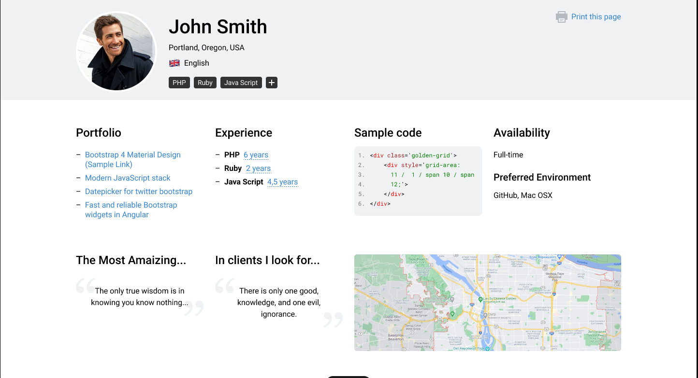
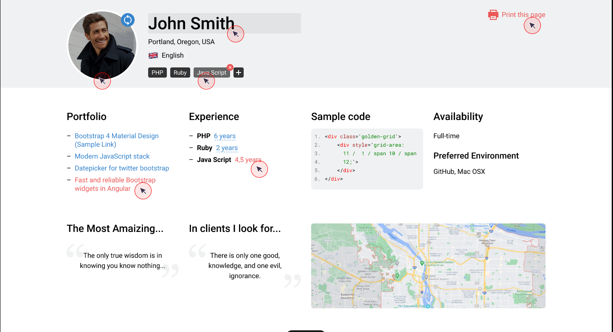
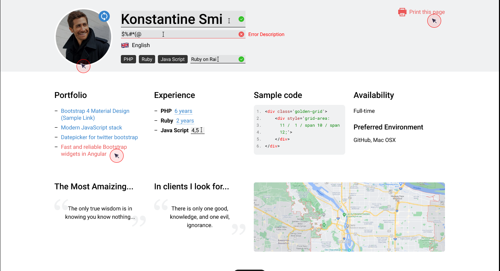

# Тестовое задание на должность PHP разработчика

## Основная часть

Необходимо разработать API для web-приложения с использованием PHP фреймворка
Laravel в соответствие с макетами дизайна:

https://www.figma.com/file/pChi3MtZsaTQhXSdRnpEjE/Axeta?node-id=1%3A2 .

### Функциональные требования

1. Возврат динамических данных для страницы.
2. Редактирование имени.
3. Редактирование местоположения.
4. Возврат координатов по названию местоположения.
5. Управление скилами (добавление, удаление, редактирование кол-ва лет опыта).

### Дополнительные требования к функционалу:

1. При редактировании поля с именем пользователя необходимо запретить ввод
   специальных символов.
2. Для определения координат по местоположению возможно использование
   любого картографического сервиса.
3. Список скилов должен возвращаться в отсортированном виде по убыванию
   количества лет опыта.

### Персистентность

Для хранения данных можно использовать любую реляционную СУБД из списка:

1. MySQL;
2. PostgreSQL;
3. MSSQL.

### Документирование

Необходимо задокументировать все разработанные методы в формате OpenAPI 3.0.

### При разработке необходимо учитывать следующие факторы:

1. Приложение должно следовать рекомендациями (guidelines) и лучшим
   практикам разработки приложений на Laravel, в соответствие с официальной
   документацией.
2. Результирующий PHP код должен быть чистым и структурированным в
   соответствие с представленной архитектурой страницы.

### При оценке результата будут приняты во внимание следующие критерии:

1. Логичная структура приложения.
2. Грамотность использования PHP.
3. Поведение методов API в крайних ситуациях.
4. Производительность кода.
5. Оформление кода.Дополнительные задачи

## Дополнительные задачи не являются обязательной частью. Тем не менее, выполнение

этих задач будет плюсом.

### Задание 1

Разработанное приложение обернуть в docker контейнер и настроить docker-compose.

### Задание 2

Реализовать в API метод для обновления аватара пользователя.

### Задание 3

Реализовать контроллер для формирования версии страницы для печати в HTML
формате. Верстка страницы для печати может быть максимально упрощена. Важно,
чтобы был отображен контент страницы в понятном виде.

## Подключение

- скачать репозиторий
- docker: docker compose up -d
- php artisan composer install
- php artisan migrate --seed
- php artisan storage:link
- host: http://axeta.test:91/
- swagger: http://axeta.test:91/api/documentation
- MySQL:
    - login: axeta
    - password: root
- [Коллекция для postman](storage/postman_collection.json)
